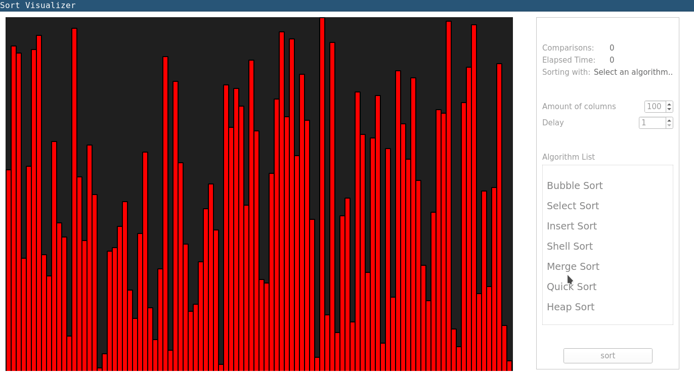

<h2 align="center">Sort Visualizer</h2>

#### intro

a qt-python project to visualize the popular sorting algorithm

#### Screenshot



#### Prerequisite

install python PySide2 module

```
pip install PySide2
```

#### Usage

+ run program

```
python main.py
```


+ select a sorting algorithm

+ (optional) specify the amount of columns and the delay of sorting process

***Note***: you can cancel the sorting process when it's running by clicking the cancel button :)
